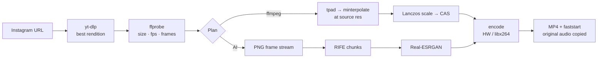

# Reel Downloader — best-quality Instagram downloads + 4K 60 fps enhancement

A free, self-hostable web app that downloads Instagram **reels, posts and stories** in the
highest quality Instagram actually serves, and optionally **enhances them to 4K (2160p) at
60 fps** with motion-compensated frame interpolation and high-quality upscaling. Paste a link
anywhere on the page and it starts.

The default enhancement engine is **classical signal processing in ffmpeg — not AI**. An
optional, *experimental and unverified* AI engine (RIFE + Real-ESRGAN neural networks) is wired
in for people who install those binaries; see [Is any of this AI?](#is-any-of-this-ai).

## The honest part first: Instagram does not serve 4K

Every upload is re-encoded by Instagram. Its CDN tops out at **1080 × 1920, usually 30 fps**
(occasionally 60). No downloader can retrieve pixels Instagram never stored, so any tool that
"downloads 4K" is upscaling behind your back.

What this app does instead:

1. **Always grabs the real top rendition.** Instagram exposes several progressive MP4s plus a
   DASH manifest per video; some renditions don't even carry a resolution. Many downloaders take
   whatever appears first. We decode the CDN's `efg` rendition tag to size unsized formats, rank
   everything by resolution → frame rate → bitrate, and merge the best video and audio streams.
2. **Enhances locally, and says so.** The 4K 60 fps file is *computed* on your server:
   - frame interpolation at the source resolution (cheaper and cleaner than at 4K),
   - Lanczos upscaling (or Real-ESRGAN in AI mode),
   - a light pass of contrast-adaptive sharpening (CAS) — enough to restore perceived detail,
     gentle enough to avoid the halos and "oil-painting" look that make upscales feel artificial.
3. **Shows you both files.** The original best rendition is always offered alongside the
   enhanced one, with real dimensions, frame rate and bitrate read back from the output.

## Features

- Paste-to-go: an Instagram link pasted anywhere on the page (even inside share-sheet text)
  starts the job immediately
- Reels, posts (incl. carousels), IGTV, stories, highlights and `/share/` links
- Best-rendition selection (yt-dlp with a custom format selector)
- Enhancement presets: resolution *original / 1440p / 4K*, frame rate *original / 60*
- Engines: **ffmpeg** (`minterpolate` + Lanczos + CAS) by default; **AI** (`rife-ncnn-vulkan` +
  `realesrgan-ncnn-vulkan`, or `video2x`) if you install the binaries — experimental
- Hardware encoding auto-detected (VideoToolbox / NVENC / QSV), libx264 fallback
- Logins without copying cookies: on your own machine the app reuses your browser's Instagram
  session automatically when Instagram demands one; servers can hold a session in env vars;
  users can still paste a cookie
- Progress reporting, cancellation, per-IP limits, automatic file expiry
- No database, no build step: FastAPI + vanilla JS

## Quick start

Requirements: Python 3.11+, ffmpeg 5+ (`brew install ffmpeg` / `apt install ffmpeg`).

```bash
python3 -m venv .venv && source .venv/bin/activate
pip install -r requirements.txt
uvicorn app.main:app --host 127.0.0.1 --port 8000
```

Open <http://127.0.0.1:8000>, paste a link, pick **Enhance → 4K 60 fps** or **Original**.

### Docker

```bash
docker compose up --build
# or
docker build -t reel-downloader . && docker run -p 8000:8000 -v reel-data:/data reel-downloader
```

Instagram changes often; if downloads start failing, rebuild the image / `pip install -U yt-dlp`.

## Logins: stories, private accounts — and most reels

Instagram now login-walls almost everything for anonymous visitors (the API replies "not
granting access", GraphQL returns empty, even the embed page is a login shell). Stories always
need a login; ordinary reels usually do too unless Meta has whitelisted the account. The app
therefore tries anonymously first and, when Instagram insists, uses the first credential it can
find:

| Priority | Source | Friction |
|---|---|---|
| 1 | Cookie pasted in the UI (**Advanced** panel) — a bare `sessionid`, a full `Cookie:` header, or a `cookies.txt` export | end user pastes once (optionally remembered in *their* browser) |
| 2 | `IG_SESSIONID` / `IG_COOKIES` / `IG_COOKIES_FILE` / `IG_COOKIES_FROM_BROWSER` on the server | zero — set once by the operator |
| 3 | **Automatic browser login** (`AUTO_BROWSER_COOKIES=local`, the default): for requests coming from the same machine as the server, the Instagram session of a locally installed browser is read via yt-dlp | zero — just be logged in to instagram.com in your browser |

How the automatic browser login behaves:

- Only the browser's **default profile** is read (`BROWSER_COOKIE_ORDER=safari,chrome,firefox,…`).
  Name a profile to use another one, e.g. `BROWSER_COOKIE_ORDER="chrome:Profile 3,chrome"` —
  the app never scans every profile, because on a shared computer that could pick up someone
  else's account.
- macOS: Safari's cookie file is only readable if the terminal has **Full Disk Access**; Chrome
  and Brave trigger a one-time Keychain prompt ("Chrome Safe Storage" → *Always Allow*). The
  first lookup can take ~20 s while Chrome's cookie store is decrypted; results are cached.
- Requests that arrive through a proxy (`X-Forwarded-For` present) are never treated as local,
  so remote users cannot borrow the operator's login. `AUTO_BROWSER_COOKIES=always` disables that
  protection — only for a single-user box. `off` disables the feature.
- When nothing is found, the error says exactly what was checked, e.g. *"Chrome: not logged in
  to Instagram; Safari: no permission to read its cookies"*.

The status card shows which login was used (*anonymous*, *your Chrome login*, …). Pasted and
discovered cookies live in an in-memory cookie jar for that job only and are never written to
disk or logs. Use a throwaway account on a public server: Instagram may challenge accounts that
fetch a lot.

## Is any of this AI?

Out of the box: **no**. The default engine is deterministic signal processing inside ffmpeg:

| Step | What it actually is |
|---|---|
| Frame interpolation (`minterpolate`) | block-matching motion estimation + motion-compensated blending — codec-style math, no learned model |
| Upscaling (`scale=…:flags=lanczos`) | a fixed resampling kernel |
| Sharpening (`cas`) | AMD's contrast-adaptive sharpening formula |

It yields a smooth, natural 4K60 rendition but cannot invent detail that was never in the
1080p source. Best-rendition selection, error handling and cookie discovery are plain
heuristics too.

The **AI engine** does use neural networks — RIFE (learned optical-flow interpolation) and
Real-ESRGAN (GAN super-resolution that reconstructs plausible texture) — but only when you
install their binaries. It is **experimental and unverified**: the pipeline has been exercised
against stub programs that reproduce the documented CLI behaviour of `rife-ncnn-vulkan` and
`realesrgan-ncnn-vulkan`, not against the real models on real hardware. Expect to tune models,
tile sizes and GPU settings yourself.

## AI mode (optional, experimental)

Install any of the following and the *Auto* engine will use them:

- [`rife-ncnn-vulkan`](https://github.com/nihui/rife-ncnn-vulkan/releases) — frame interpolation
- [`realesrgan-ncnn-vulkan`](https://github.com/xinntao/Real-ESRGAN/releases) — super-resolution
- [`video2x`](https://github.com/k4yt3x/video2x/releases) — wraps both; used when the two above are missing

Put the binaries (with their `models/` folders) on `PATH`, or point `RIFE_BIN` /
`REALESRGAN_BIN` / `VIDEO2X_BIN` at them. They run on any Vulkan-capable GPU (including Apple
Silicon via MoltenVK); CPU-only machines should stay on the ffmpeg engine.

The ncnn pipeline streams frames: ffmpeg decodes once → chunks of `AI_CHUNK_FRAMES` (with the
overlap RIFE needs) → RIFE → Real-ESRGAN → straight into a single encoder process. Disk usage is
bounded by one chunk, whatever the clip length. Expect roughly 1–5 fps of output at 4K on a
mid-range GPU, i.e. several minutes per reel.

## How enhancement works



Details worth knowing:

- **Targets**: "4K" means the short side reaches 2160 px with the long side capped at 3840
  (1080×1920 → 2160×3840, 1080×1350 → 2160×2700, landscape → 3840×2160).
- **Frame rate**: the multiplier is a small rational so frames land on an exact grid:
  30 → 60 (×2), 25 → 60 (×12/5), 24 → 60 (×5/2). NTSC sources snap to ×2 (29.97 → 59.94) to
  avoid audio drift.
- **Tail fix**: `minterpolate` silently drops the last ~1.5 source frames; we clone the final
  frame before interpolating and trim afterwards, so the enhanced clip has the same length.
- **Encoding**: libx264 CRF 18 by default; hardware encoders get a bitrate derived from
  `BITS_PER_PIXEL` (≈ 40 Mbps for 4K60). Audio is copied untouched.

## Configuration

All settings are environment variables — see [`.env.example`](.env.example) for the full,
commented list. The important ones:

| Variable | Default | Purpose |
|---|---|---|
| `DATA_DIR` | `./data` | where job files live |
| `JOB_TTL_MINUTES` | `60` | files are deleted this long after a job finishes |
| `MAX_CONCURRENT_JOBS` | `2` | parallel jobs (enhancement is CPU/GPU heavy) |
| `MAX_JOBS_PER_IP` | `2` | active jobs per client |
| `MAX_DURATION_SECONDS` | `600` | longest clip that will be *enhanced* |
| `VIDEO_ENCODER` | `auto` | `libx264`, `libx265`, `h264_videotoolbox`, `h264_nvenc`, … |
| `X264_PRESET` / `X264_CRF` | `medium` / `18` | software-encoder quality |
| `SHARPEN` | `0.3` | CAS strength after upscaling, `0` disables |
| `FFMPEG_INTERP_QUALITY` | `high` | `fast` is ~2× quicker with slightly more ghosting |
| `IG_SESSIONID` etc. | — | Instagram login configured on the server (see above) |
| `AUTO_BROWSER_COOKIES` | `local` | reuse a local browser's Instagram login for same-machine requests (`always`, `off`) |
| `BROWSER_COOKIE_ORDER` | `safari,chrome,…` | browsers/profiles to check, yt-dlp `BROWSER[:PROFILE]` syntax |
| `AI_ENGINE` | `auto` | `ncnn`, `video2x`, or `off` |
| `AI_UPSCALE_MODEL` | `realesrgan-x4plus` | `realesr-animevideov3` is much faster |
| `AI_CHUNK_FRAMES` | `32` | frames per AI batch (disk vs. model-reload trade-off) |

## API

| Method | Path | Notes |
|---|---|---|
| `GET` | `/api/capabilities` | encoder, AI availability, auth status (incl. whether browser login applies to you), limits |
| `POST` | `/api/jobs` | `{"url", "mode": "enhance"\|"original", "resolution": "2160p"\|"1440p"\|"original", "fps": "60"\|"original", "engine": "auto"\|"ffmpeg"\|"ai", "cookies"?}` → `202` job |
| `GET` | `/api/jobs/{id}` | status, stage, progress, sources, plan, outputs, warnings |
| `DELETE` | `/api/jobs/{id}` | cancel a running job or delete a finished one |
| `GET` | `/api/jobs/{id}/files/{index}?inline=1` | download (or stream) an output |

Interactive docs at `/api/docs`.

## Performance expectations

Measured on an Apple-silicon laptop with the ffmpeg engine and VideoToolbox: a 5 s, 720p30
reel → 2160×3840 @ 60 fps in ~23 s (≈ 4.5× real time). A 60 s 1080p30 reel takes a few minutes;
software-only x264 on a small VPS can take 10–20 minutes. Free hosting tiers have weak CPUs,
tiny disks and datacenter IPs that Instagram tends to block — this runs best on your own
machine or a modest VPS.

## Development

```bash
pip install -r requirements-dev.txt
pytest            # unit tests + real-ffmpeg pipeline tests on a synthetic clip
ruff check . && ruff format .
```

The AI pipeline is exercised with stub binaries that reproduce the documented CLI semantics of
`rife-ncnn-vulkan` and `realesrgan-ncnn-vulkan`; the AI and video2x engines remain unverified
until someone runs them against the real binaries on real hardware.

## Limitations

- Photo posts / photo stories are skipped (video only).
- Instagram rate-limits and login-walls anonymous traffic, especially from cloud IPs; a login
  (browser session or pasted cookie) fixes most "empty media response" errors.
- The automatic browser login needs a browser on the *server's* machine, so it only helps when
  you run the app locally.
- Upscaling cannot invent true detail — the result is a clean, natural-looking 4K60 rendition of
  a 1080p30 source, not the creator's camera original.

## Legal

Download only content you own or have permission to use, and respect Instagram's Terms of
Service. This project is intended for personal use and is not affiliated with Instagram/Meta.
